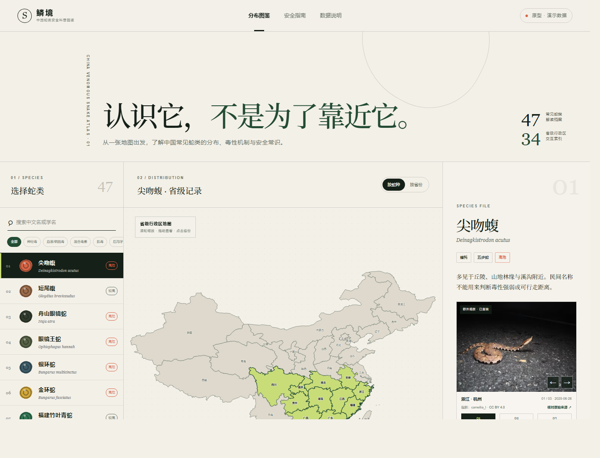
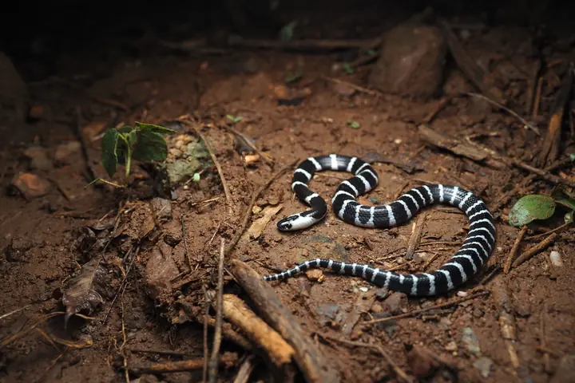
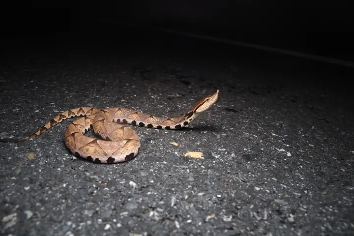
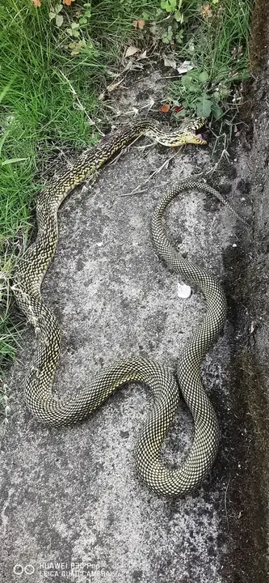
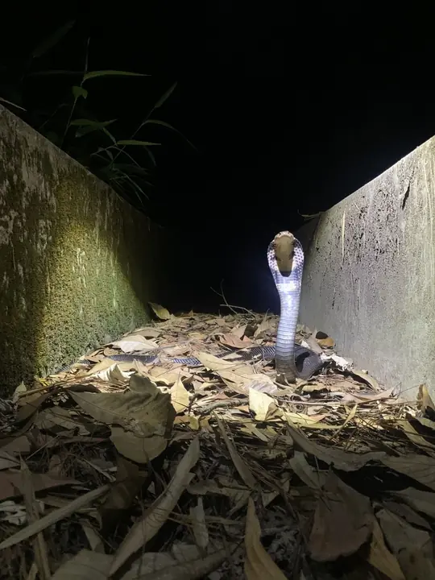
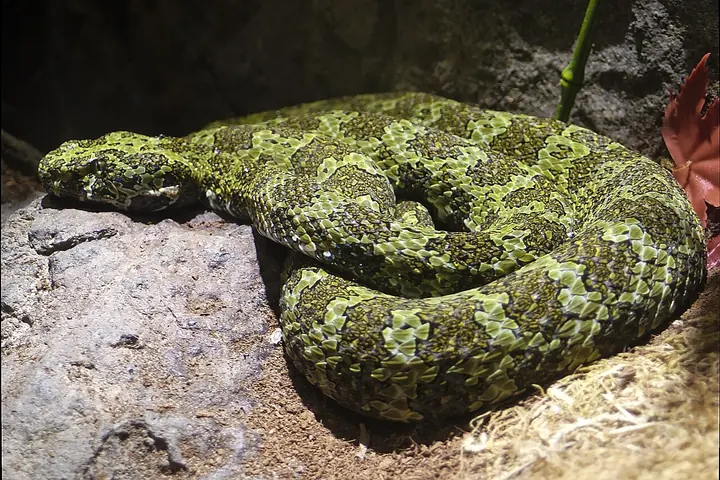
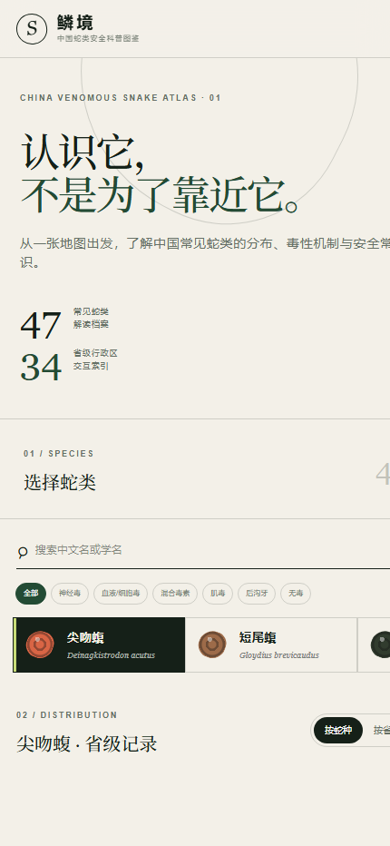

# 鳞境｜中国蛇类安全科普图鉴

一张可以双向查询的中国蛇类地图：选择蛇种查看省级分布，或点击省份浏览当地当前收录的蛇类；同时了解外观差异、毒性机制、中毒表现、医院常查指标与遇蛇安全常识。

**在线体验：** [snake-atlas-china.sebastianklx6.chatgpt.site](https://snake-atlas-china.sebastianklx6.chatgpt.site)　·　**当前版本：** 47 种蛇类 / 34 个省级行政区 / 136 张开放许可图片



## 为什么做鳞境

互联网上的蛇类资料往往散落在论文、地方名录、观察数据库和自媒体内容中。普通读者最关心的三个问题——“这是什么蛇”“当地可能有哪些蛇”“被咬后会发生什么”——很难在同一个界面中找到清楚、可核对的答案。

鳞境希望提供一个克制的安全科普入口：让地图承担索引，让真实图片帮助远距离认识形态，让毒性与医疗信息保持可读，同时反复提醒使用者不要靠近、捕捉或仅凭网页自行鉴蛇。

## 核心体验

### 1. 从蛇种到地图

搜索或按毒性类型筛选蛇类后，地图会突出当前档案收录的省级分布。每个蛇种页面包含中文名、学名、科属、危险等级、栖息环境和分布数量。

### 2. 从省份到蛇种

切换“按省份”或直接点击地图，即可查看该省当前图鉴收录的蛇类；再点蛇名可回到完整物种档案。地图同时支持滚轮缩放、拖动、触摸和键盘选择。

### 3. 从外观到安全常识

每个档案不只描述颜色，还会说明体形、鳞片、头部与斑纹特征，并列出容易混淆的蛇。例如幼年眼镜蛇与银环蛇都可能呈现醒目黑白对比，但环纹连续性、体形和防御姿态仍有区别。所有辨识内容都只用于远距离观察。

### 4. 从毒性到医院监测

内容按神经毒、血液/细胞毒、混合毒、肌毒、后沟牙和无毒咬伤分类。除症状发展外，还解释医院可能关注的血常规、血小板、PT/INR、APTT、纤维蛋白原、肌酐、CK、肌红蛋白、电解质、血气、尿量和神经肌力等指标。

首次检查正常不能自行排除迟发性中毒；具体检查、复查频率和治疗必须由接诊医生决定。

## 完整蛇种档案示例

下面三个例子分别代表神经毒蛇、血液/细胞毒蛇和无毒蛇。桌面端横向对照，更容易看出不同类型档案关注点的区别。

<table>
  <thead>
    <tr>
      <th width="33%">银环蛇 · 强神经毒</th>
      <th width="33%">尖吻蝮 · 血液/细胞毒</th>
      <th width="33%">王锦蛇 · 无毒</th>
    </tr>
  </thead>
  <tbody>
    <tr>
      <td valign="top"></td>
      <td valign="top"></td>
      <td valign="top"></td>
    </tr>
    <tr>
      <td valign="top"><strong>Bungarus multicinctus</strong><br />眼镜蛇科 · 高危 · 夜行性</td>
      <td valign="top"><strong>Deinagkistrodon acutus</strong><br />蝰科 · 高危 · 又称“五步蛇”</td>
      <td valign="top"><strong>Elaphe carinata</strong><br />游蛇科 · 大型无毒蛇</td>
    </tr>
    <tr>
      <td valign="top"><strong>分布</strong><br />皖、浙、赣、闽、鄂、湘、粤、桂、琼、贵、云、川。</td>
      <td valign="top"><strong>分布</strong><br />皖、浙、赣、闽、鄂、湘、粤、桂、渝、川、贵。</td>
      <td valign="top"><strong>分布</strong><br />豫、苏、皖、浙、赣、闽、鄂、湘、粤、桂、渝、川、贵、云、陕。</td>
    </tr>
    <tr>
      <td valign="top"><strong>外观与区别</strong><br />蓝黑身体配数量较多的窄白环，背脊鳞片扩大。幼年眼镜蛇浅色横纹通常更不规则；看不清时一律不要接触。</td>
      <td valign="top"><strong>外观与区别</strong><br />体形粗壮、吻端上翘，背部成对三角斑常组成 X 形。“三角头”不能单独证明是毒蛇。</td>
      <td valign="top"><strong>外观与区别</strong><br />身体粗壮、鳞片起棱，深色鳞缘形成网纹。可能被误认成眼镜王蛇或大型蝰蛇。</td>
    </tr>
    <tr>
      <td valign="top"><strong>症状</strong><br />伤口可能不痛不肿，随后出现眼睑下垂、复视、吞咽困难和肌无力；严重时呼吸肌麻痹。</td>
      <td valign="top"><strong>症状</strong><br />明显疼痛、持续肿胀、瘀斑、血疱和渗血；严重时可发生休克、少尿和急性肾损伤。</td>
      <td valign="top"><strong>咬伤</strong><br />不会造成蛇毒中毒，但仍可能形成多排牙痕、出血、肿胀及较深的软组织创口。</td>
    </tr>
    <tr>
      <td valign="top"><strong>医疗关注</strong><br />呼吸、血氧、血气、吞咽与肌力，以及电解质、肝肾功能和心电图。</td>
      <td valign="top"><strong>医疗关注</strong><br />血红蛋白、血小板、PT/INR、APTT、纤维蛋白原、肌酐、电解质及尿量。</td>
      <td valign="top"><strong>医疗关注</strong><br />创口深度、异物、肌腱及神经血管功能，并评估感染和破伤风风险。</td>
    </tr>
    <tr>
      <td valign="top"><strong>安全提示</strong><br />伤口不疼不能排除中毒，疑似咬伤应减少活动并立即就医。</td>
      <td valign="top"><strong>安全提示</strong><br />“五步蛇”只是俗名；不要切开、吸吮或自行绑扎伤口。</td>
      <td valign="top"><strong>安全提示</strong><br />无毒不等于温顺；不围堵、不触摸，也不要徒手搬移。</td>
    </tr>
    <tr>
      <td valign="top"><sub>camellia_l · 海南东方 · CC BY 4.0<br /><a href="https://www.inaturalist.org/observations/322440222">原始观察</a></sub></td>
      <td valign="top"><sub>camellia_l · 浙江杭州 · CC BY 4.0<br /><a href="https://www.inaturalist.org/observations/322433736">原始观察</a></sub></td>
      <td valign="top"><sub>angryphyco · 福建宁德 · CC BY 4.0<br /><a href="https://www.inaturalist.org/observations/310452858">原始观察</a></sub></td>
    </tr>
  </tbody>
</table>

> 这些档案用于安全科普，不用于远程确诊蛇种或替代医疗判断。无法确认蛇种时，应保留安全距离拍摄的照片并按疑似毒蛇处理。

## 蛇类图片如何使用

图库目前包含 136 张图片记录。大多数蛇种提供三张不同角度或个体的图片，并在页面中逐张显示摄影者、日期、地点、许可类型和原始来源链接。

<table>
  <tr>
    <td width="33%" align="center"><br /><b>银环蛇</b><br /><sub>摄影：camellia_l · CC BY 4.0<br /><a href="https://www.inaturalist.org/observations/322440222">原始观察</a></sub></td>
    <td width="33%" align="center"><br /><b>舟山眼镜蛇</b><br /><sub>摄影：灯管儿 · CC BY 4.0<br /><a href="https://www.inaturalist.org/observations/143865436">原始观察</a></sub></td>
    <td width="33%" align="center"><br /><b>莽山原矛头蝮</b><br /><sub>摄影：Junkyardsparkle · CC0<br /><a href="https://commons.wikimedia.org/wiki/File:Protobothrops_mangshanensis_mang_pitviper_LA_zoo_side.jpg">原始来源</a></sub></td>
  </tr>
</table>

图片主要来自 iNaturalist 研究级观察、Wikimedia Commons 明确授权文件和台湾生物多样性网络的专家鉴定记录。站点会区分野外观察、圈养个体、渔获记录与物种插画，不把圈养照片伪装成中国境内野外记录。

少数稀有蛇种暂时无法获得三张身份明确且允许再利用的照片：中华钝头蛇目前 2 张，双斑锦蛇 1 张；高原蝮暂以一张公开领域物种插画占位。项目宁可少放，也不会使用相似物种或生成图片凑数。

为改善加载速度，原始图片被转换为本地 AVIF/WebP 缩略图并启用懒加载，不依赖外站热链。完整的逐图作者、来源和许可清单见 [IMAGE_LICENSES.md](IMAGE_LICENSES.md)。

## 界面截图

### 桌面端

桌面布局同时呈现蛇种列表、省级地图和物种详情，方便在分布与形态资料之间快速切换。


### 移动端

移动端将三个区域改为纵向浏览，蛇种列表支持横向滑动，地图和详情保持完整交互。



## 数据口径与限制

| 模块 | 当前做法 | 仍需完善 |
|---|---|---|
| 物种名录 | 收录 47 种常见、有代表性或容易混淆的蛇类 | 继续补充中国记录种并追踪分类变化 |
| 省级分布 | 以省级行政区作为科普索引 | 逐条关联出版物、标本或可信观察记录 |
| 毒性与症状 | 按毒性系统归纳典型表现 | 邀请蛇伤临床与动物分类专业人员复核 |
| 图片 | 只采用身份和开放许可可以核验的来源 | 为稀有种继续寻找可靠的多角度照片 |

当前分布属于持续校订中的科普演示数据，不代表完整调查结果，也不能据此断言某地不存在某种蛇。

## 技术与性能

- Next.js 16、React 19、TypeScript
- vinext + Vite，输出 Cloudflare Worker 兼容构建
- `china-map-geojson` 绘制省级 SVG 地图
- 地图模块延迟加载，降低首屏 JavaScript 负担
- 图片使用 AVIF/WebP、固定尺寸和原生懒加载
- 响应式桌面/移动布局与键盘可访问交互
- 无数据库、无登录依赖，公开页面可匿名访问

## 本地运行

需要 Node.js `>=22.13.0`。

```bash
git clone https://github.com/kunwl123456/linjing.git
cd linjing
npm install
npm run dev
```

浏览器访问 `http://localhost:3000/`。生产构建使用：

```bash
npm run build
```

## 项目结构

```text
app/
  page.tsx          页面交互与内容布局
  china-map.tsx     中国省级 GeoJSON 地图
  snake-data.ts     蛇种、分布、症状与医疗指标数据
  snake-images.ts   图片来源与许可元数据
  globals.css       页面样式
public/snakes/      本地 AVIF/WebP 图片
docs/screenshots/   项目界面截图
```

## 资料来源

医疗科普主要参考国家卫健委《常见动物致伤诊疗规范（2021年版）》和 WHO《Guidelines for the management of snakebites, 2nd edition》。地图数据来自 `china-map-geojson`，该软件包采用 ISC 许可证。

本项目用于安全科普，不用于现场物种鉴定、捕捉指导或医疗诊断。疑似毒蛇咬伤时，不要等待网页鉴定或自行解读化验结果，应减少活动并立即联系 120 或前往具备蛇伤救治能力的医院。

## 参与贡献

欢迎提交分布资料勘误、分类更新、可靠图片来源、文献整理和无障碍改进。提交前请阅读 [CONTRIBUTING.md](CONTRIBUTING.md)；涉及分布或医疗信息的修改必须附可核验来源。

## 后续计划

- 为每条省级分布记录增加独立参考文献
- 增加可分享的蛇种独立链接
- 完善离线浏览和低网速体验
- 邀请动物分类、蛇伤临床与自然教育从业者参与审核
- 建立透明的赞助用途和版本更新记录

## 许可证

源代码采用 [MIT License](LICENSE)。`public/snakes/` 中的第三方图片不适用 MIT License，仍分别受 [IMAGE_LICENSES.md](IMAGE_LICENSES.md) 所列许可证约束。
